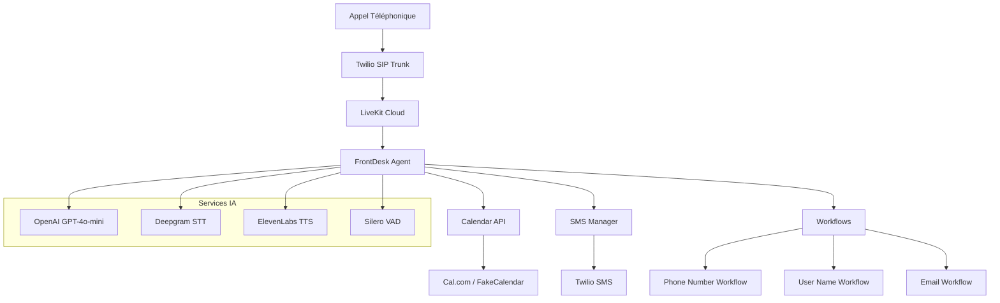
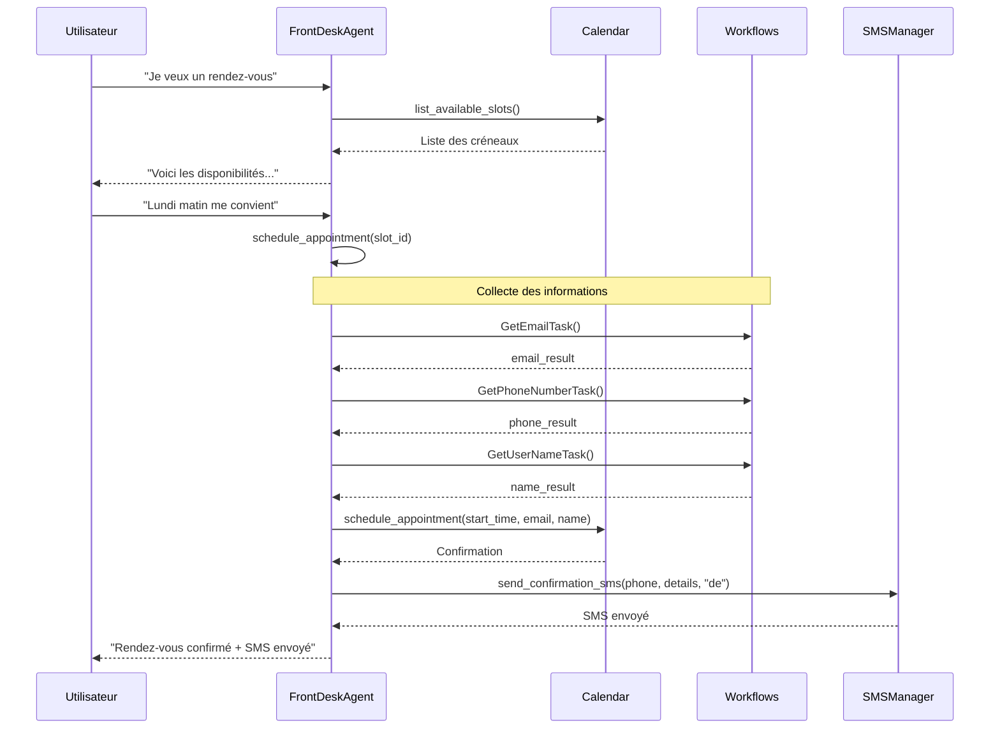
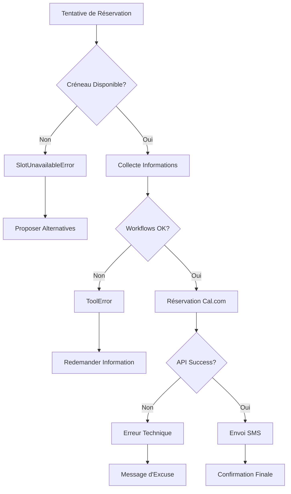
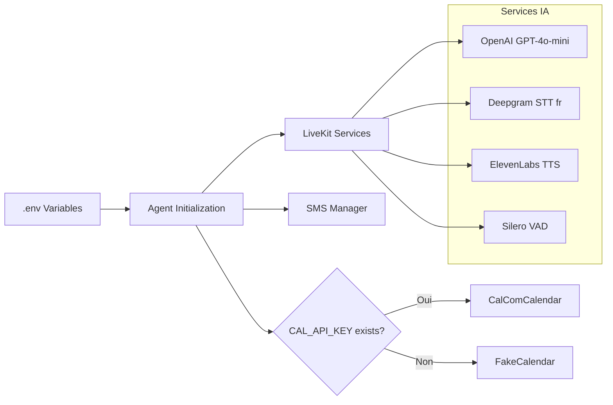
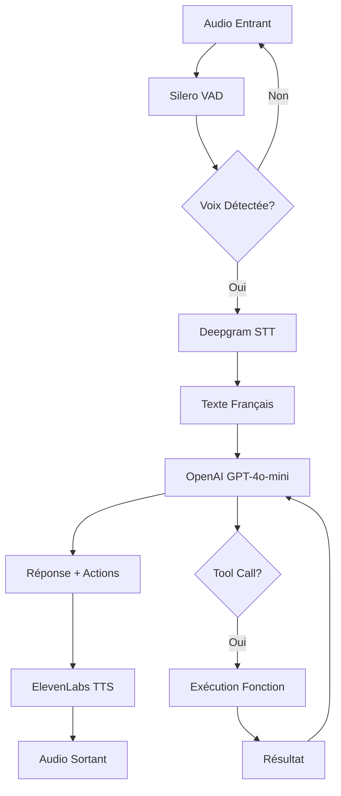

# Vue d'ensemble complète du codebase FrontDesk

## 🎯 **Objectif du Projet**

Ce projet implémente un **assistant vocal intelligent pour salons de coiffure** utilisant l'IA pour automatiser l'accueil téléphonique et la prise de rendez-vous. L'assistant peut répondre aux questions fréquentes, gérer les réservations via Cal.com, et envoyer des confirmations SMS.

## 🏗️ **Architecture Générale**



## 📁 **Structure des Fichiers**

### **Fichiers Principaux**

| Fichier | Rôle | Description |
|---------|------|-------------|
| `frontdesk_agent.py` | 🤖 **Agent Principal** | Classe principale `FrontDeskAgent` avec logique conversationnelle |
| `calendar_api.py` | 📅 **Gestion Calendrier** | Interface pour Cal.com et calendrier factice |
| `twilio_server.py` | 📞 **Serveur Twilio** | Serveur pour gérer les appels entrants (mode legacy) |

### **Workflows Spécialisés**

| Fichier | Fonction | Détails |
|---------|----------|---------|
| `phone_number_workflow.py` | 📱 **Capture Téléphone** | Workflow pour collecter et valider les numéros |
| `user_name_workflow.py` | 👤 **Capture Nom** | Workflow pour collecter les noms d'utilisateur |
| `sms_manager.py` | 💬 **Envoi SMS** | Gestion des confirmations SMS multilingues |

### **Fichiers de Test et Utilitaires**

| Fichier | Usage |
|---------|-------|
| `chat_real_calendar.py` | Interface de test en mode texte avec vrai calendrier |
| `test_agent.py` | Tests unitaires de l'agent |
| `test_agent_live.py` | Tests en conditions réelles |

## 🔧 **Composants Clés et Interactions**

### **1. Agent Principal - `FrontDeskAgent`**
- **Hérite de** : `livekit.agents.Agent`
- **Responsabilités** :
  - Gestion de la conversation vocale en français
  - Orchestration des workflows de collecte d'informations
  - Interface avec le calendrier et SMS
- **Outils disponibles** :
  - `list_available_slots()` : Consultation des créneaux disponibles
  - `schedule_appointment()` : Réservation de rendez-vous

### **2. Système de Calendrier**
- **Interface** : `Calendar` (Protocol)
- **Implémentations** :
  - `CalComCalendar` : Intégration Cal.com réelle
  - `FakeCalendar` : Calendrier simulé pour tests
- **Fonctionnalités** :
  - Génération de créneaux disponibles
  - Réservation avec validation de disponibilité
  - Gestion des erreurs `SlotUnavailableError`

### **3. Workflows de Collecte**
- **Architecture** : Basée sur `livekit.agents.AgentTask`
- **Workflows disponibles** :
  - `GetPhoneNumberTask` : Validation format allemand/international
  - `GetUserNameTask` : Collecte nom complet
  - `GetEmailTask` : Collecte email (workflow beta LiveKit)

### **4. Gestionnaire SMS**
- **Classe** : `SMSManager`
- **Fonctionnalités** :
  - Support multilingue (DE, FR, EN)
  - Intégration Twilio
  - Gestion d'erreurs robuste

## 📊 **Flux de Données Principaux**

### **Flux de Réservation Complète**



### **Gestion des Erreurs**



### **Configuration et Initialisation**



### **Variables d'Environnement Requises**

| Variable | Service | Usage |
|----------|---------|-------|
| `LIVEKIT_API_KEY` | LiveKit | Authentification agent |
| `LIVEKIT_API_SECRET` | LiveKit | Authentification agent |
| `LIVEKIT_URL` | LiveKit | Endpoint WebSocket |
| `CAL_API_KEY` | Cal.com | Gestion calendrier réel |
| `OPENAI_API_KEY` | OpenAI | LLM pour conversations |
| `DEEPGRAM_API_KEY` | Deepgram | Transcription vocale |
| `ELEVEN_API_KEY` | ElevenLabs | Synthèse vocale |
| `TWILIO_ACCOUNT_SID` | Twilio | SMS et téléphonie |
| `TWILIO_AUTH_TOKEN` | Twilio | SMS et téléphonie |
| `TWILIO_PHONE_NUMBER` | Twilio | Numéro expéditeur SMS |

### **Flux de Traitement Vocal**



## 🎯 **Points Techniques Importants**

### **Gestion des Interruptions**
- `ctx.disallow_interruptions()` pendant les workflows
- `ctx.allow_interruptions()` en cas d'erreur
- Protection contre les interruptions pendant la collecte d'informations

### **Validation des Données**
- **Numéros de téléphone** : Validation avec `phonenumbers` library
- **Format E.164** : Normalisation internationale
- **Emails** : Workflow beta LiveKit avec validation

### **Multilinguisme**
- **Conversation** : Français (instructions détaillées)
- **SMS** : Support DE/FR/EN
- **STT** : Configuré pour le français (`language="fr"`)

## 🚀 **Recommandations d'Amélioration**

### **🔒 Sécurité et Robustesse**

#### **1. Gestion des Secrets**
```python
# Problème actuel : Variables d'environnement exposées
# Recommandation : Utiliser un gestionnaire de secrets
from azure.keyvault.secrets import SecretClient
from aws.secretsmanager import SecretsManagerClient
```

#### **2. Validation Renforcée**
- **Emails** : Ajouter validation regex + vérification domaine
- **Numéros** : Étendre la validation pour plus de pays
- **Données sensibles** : Chiffrement en transit et au repos

### **📈 Monitoring et Observabilité**

#### **3. Métriques Détaillées**
```python
# Ajouter dans frontdesk_agent.py
@metrics.track_duration("appointment_booking")
@metrics.track_success_rate("calendar_integration")
async def schedule_appointment(self, ...):
```

#### **4. Logging Structuré**
```python
import structlog
logger = structlog.get_logger("frontdesk")
logger.info("appointment_scheduled", 
           user_id=hash(phone), 
           slot_time=slot.start_time,
           calendar_type="calcom")
```

### **⚡ Performance et Scalabilité**

#### **5. Cache des Créneaux**
```python
# Dans calendar_api.py
from functools import lru_cache
from datetime import timedelta

@lru_cache(maxsize=128)
async def list_available_slots_cached(self, start_time, end_time):
    # Cache pendant 5 minutes pour éviter les appels API répétés
```

#### **6. Pool de Connexions**
```python
# Optimiser les connexions HTTP
connector = aiohttp.TCPConnector(
    limit=100,
    limit_per_host=30,
    keepalive_timeout=30
)
```

### **🧪 Tests et Qualité**

#### **7. Tests d'Intégration Manquants**
```python
# Créer test_integration.py
async def test_full_booking_flow():
    """Test complet : conversation → réservation → SMS"""
    
async def test_calendar_failover():
    """Test basculement Cal.com → FakeCalendar"""
```

#### **8. Tests de Charge**
```python
# Créer load_test.py avec locust
from locust import HttpUser, task
class VoiceAgentUser(HttpUser):
    @task
    def concurrent_bookings(self):
        # Simuler 100 réservations simultanées
```

### **🌍 Internationalisation**

#### **9. Support Multi-Langues Complet**
```python
# Créer i18n/locales/
# fr.json, de.json, en.json
class MultilingualAgent(FrontDeskAgent):
    def __init__(self, language="fr"):
        self.lang = language
        self.messages = load_locale(language)
```

#### **10. Détection Automatique de Langue**
```python
from langdetect import detect
# Détecter la langue de l'utilisateur automatiquement
```

### **🔧 Architecture et Maintenance**

#### **11. Pattern Repository**
```python
# Séparer logique métier et accès données
class CalendarRepository:
    async def find_available_slots(self, criteria): ...
    async def book_appointment(self, booking): ...

class BookingService:
    def __init__(self, calendar_repo, sms_service): ...
```

#### **12. Configuration Centralisée**
```python
# config.py
@dataclass
class AppConfig:
    timezone: str = "Europe/Paris"
    max_booking_days: int = 90
    sms_languages: list = field(default_factory=lambda: ["fr", "de", "en"])
    
    @classmethod
    def from_env(cls) -> "AppConfig":
        # Charger depuis variables d'environnement
```

### **📱 Fonctionnalités Avancées**

#### **13. Webhook pour Modifications**
```python
# webhook_handler.py
@app.route("/webhook/calendar", methods=["POST"])
async def handle_calendar_change():
    """Gérer annulations/modifications depuis Cal.com"""
```

#### **14. Intelligence Contextuelle**
```python
# Ajouter mémoire des préférences utilisateur
class UserPreferences:
    preferred_times: list
    preferred_services: list
    communication_language: str
```

### **🎯 Priorités de Développement**

| Priorité | Amélioration | Impact | Effort |
|----------|--------------|--------|--------|
| 🔴 **Haute** | Tests d'intégration | Fiabilité | Moyen |
| 🔴 **Haute** | Logging structuré | Debugging | Faible |
| 🟡 **Moyenne** | Cache créneaux | Performance | Faible |
| 🟡 **Moyenne** | Multi-langues | UX | Élevé |
| 🟢 **Basse** | Webhooks | Fonctionnalité | Élevé |

## 📋 **Résumé Exécutif**

### **🎯 Nature du Projet**
**FrontDesk** est un assistant vocal IA sophistiqué conçu spécifiquement pour les salons de coiffure. Il automatise l'accueil téléphonique 24h/24 et gère intelligemment les réservations de rendez-vous via une intégration Cal.com.

### **💪 Points Forts du Codebase**

1. **Architecture Modulaire** : Séparation claire des responsabilités avec des workflows spécialisés
2. **Intégration Robuste** : LiveKit + OpenAI + Deepgram + ElevenLabs pour une expérience vocale fluide
3. **Gestion d'Erreurs** : Mécanismes de fallback et validation des données
4. **Multilinguisme** : Support français/allemand/anglais pour les SMS
5. **Tests Intégrés** : Scripts de test pour validation en conditions réelles

### **⚠️ Défis Identifiés**

1. **Sécurité** : Variables d'environnement exposées, pas de chiffrement
2. **Monitoring** : Logging basique, métriques limitées
3. **Performance** : Pas de cache, appels API répétés
4. **Tests** : Couverture incomplète, pas de tests de charge
5. **Maintenance** : Configuration dispersée, pas de CI/CD

### **🚀 Recommandations Prioritaires**

| Action | Bénéfice | Complexité |
|--------|----------|------------|
| Implémenter logging structuré | Debugging facilité | ⭐ Faible |
| Ajouter tests d'intégration | Fiabilité accrue | ⭐⭐ Moyenne |
| Cache des créneaux disponibles | Performance améliorée | ⭐ Faible |
| Gestionnaire de secrets | Sécurité renforcée | ⭐⭐⭐ Élevée |

## 🔒 **Correction de Sécurité Appliquée**

### **Problème Identifié**
La fonction `setup_langfuse()` exposait les credentials Langfuse dans les variables d'environnement système via :
```python
os.environ["OTEL_EXPORTER_OTLP_HEADERS"] = f"Authorization=Basic {langfuse_auth}"
```

### **Solution Implémentée**
Modification pour passer les credentials directement à l'exporter sans les exposer :
```python
# SÉCURISÉ: Headers passés directement à l'exporter
langfuse_auth = base64.b64encode(f"{public_key}:{secret_key}".encode()).decode()
endpoint = f"{host.rstrip('/')}/api/public/otel"
headers = {"Authorization": f"Basic {langfuse_auth}"}

exporter = OTLPSpanExporter(
    endpoint=endpoint,
    headers=headers
)
```

## 🎉 **Conclusion**

Le codebase FrontDesk présente une **architecture solide et bien pensée** pour un assistant vocal professionnel. La base technique est excellente avec LiveKit Agents, et l'intégration Cal.com offre une solution complète pour les salons.

Les améliorations suggérées visent principalement à **renforcer la robustesse en production** et à **faciliter la maintenance à long terme**. Le projet est déjà fonctionnel et prêt pour un déploiement pilote, avec un potentiel d'évolution vers une solution SaaS multi-tenant.

**Verdict** : ✅ **Codebase de qualité professionnelle** avec une roadmap claire pour l'amélioration continue.